# D1A プレイグラウンド — 13のユースケース

[English](README.md)

小さな判断モデルが1つの文書を読み、それについての型付きの質問にいくつか答え、すべての選択肢に確率を返します。このプレイグラウンドでは、その仕組みで13の実際の仕事をライブで動かします。プロンプトのモデル振り分け、プロンプトインジェクションのブロック、エージェントのツール呼び出しの制御、受信トレイの仕分け、検索結果のリランキング、LLM の回答の採点、表のラベル付け、ロボットのリアルタイム制御、実行するか人に回すかの判断、そして写真・音声メモ・短い動画からの、配達荷物の破損チェックとドライバーの連絡の振り分け、そしてプルリクエストのラベル付けです。どの例も編集でき、どの答えにも確率の分布全体が表示されます。

D1A は Jared Palmer による [Kev](https://github.com/jaredpalmer/kev)（Apache-2.0）をベースにしています。D1A は Jared Palmer および Kev プロジェクトとは提携しておらず、推奨も受けていません。プレイグラウンドでは、Gemma 4 E2B をベースにした1エポックのモデル D1A-E2B v0.1（[JohnP1/d1a-e2b](https://huggingface.co/JohnP1/d1a-e2b)、タグ `v0.1-1epoch`、旧 JohnP1/kev-gemma4-e2b）を使います。このモデルはフォーク [jonpol01/kev](https://github.com/jonpol01/kev) の Gemma 4 対応で学習しました。

## 13のデモ

実際に動かしている様子の短い録画です（ダークテーマ、画面は日本語）。どれも、例を選び、ボタンを押し、確率つきの答えが出るまでを映しています。録画は1回の実行のもので、手元では少し違う値になります。

**1. モデルの振り分け**: 各プロンプトを、処理できる一番安いモデルに送ります。

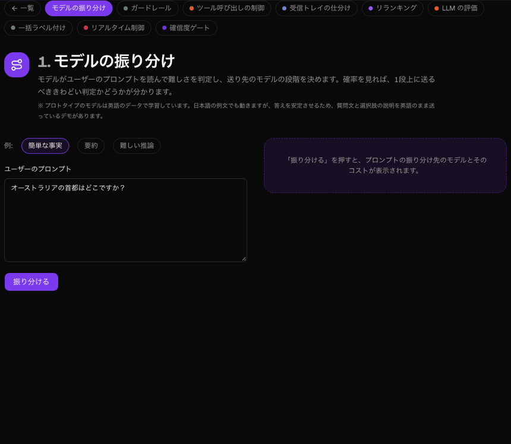

**2. ガードレール**: プロンプトインジェクションや暴言を、LLM に届く前に止めます。

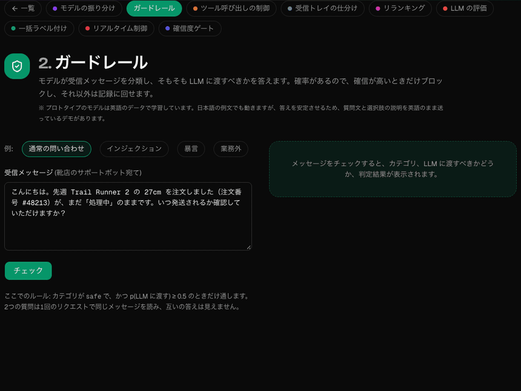

**3. ツール呼び出しの制御**: エージェントの操作を、実行する・人に確認する・実行しない、に分けます。

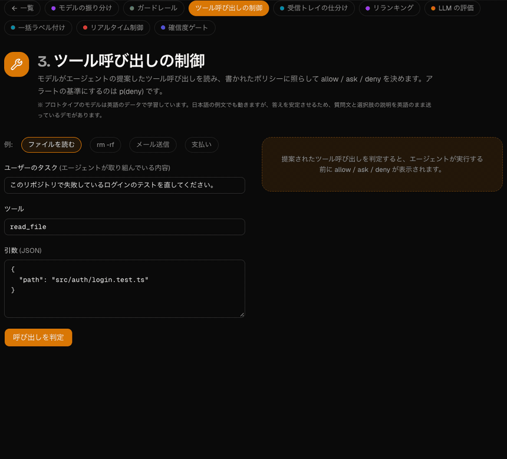

**4. 受信トレイの仕分け**: たまったメールから、今日対応すべきものを選び出します。

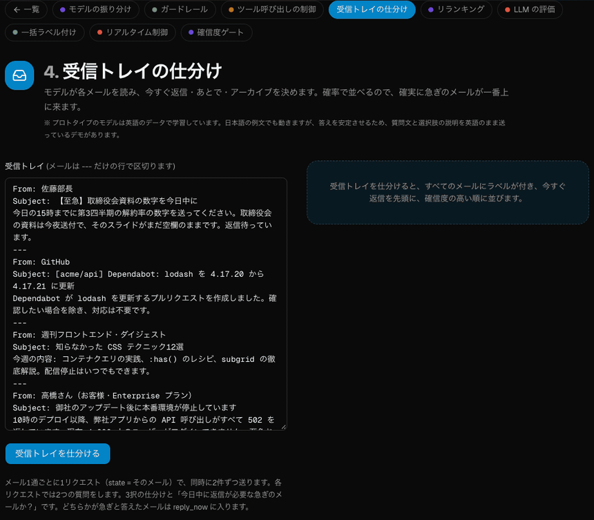

**5. リランキング**: 検索結果を、質問に答えているかどうかで並べ直します。

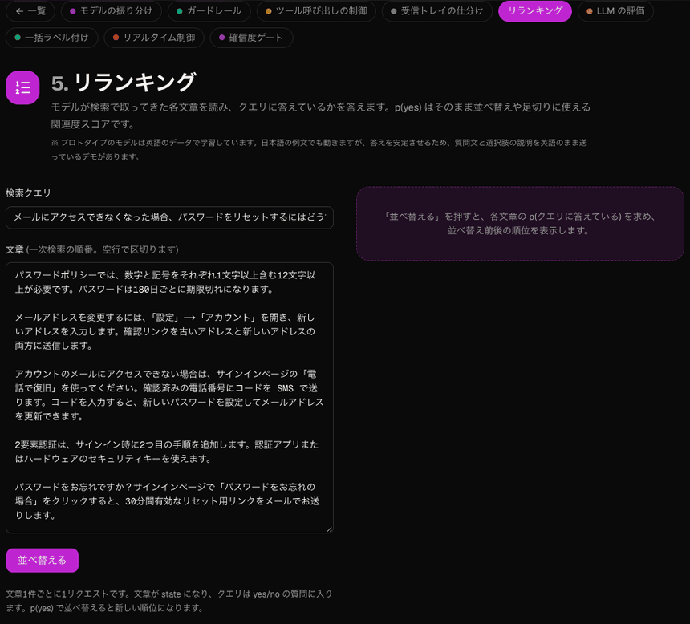

**6. LLM の評価**: LLM の回答を、当て推量ではなくスコアと分布で採点します。

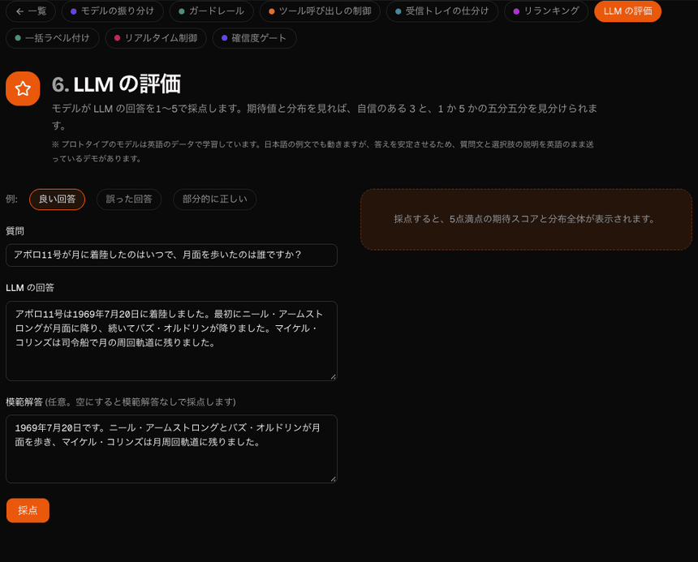

**7. 一括ラベル付け**: 表全体にラベルを付け、人が確認すべき行を示します。

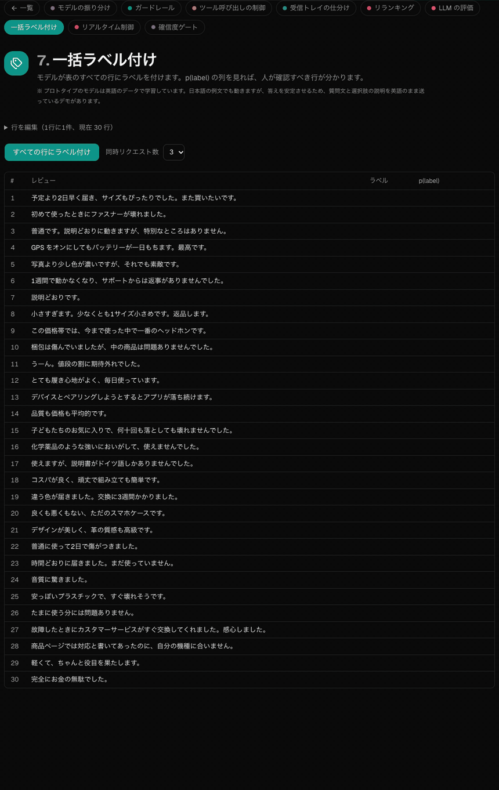

**8. リアルタイム制御**: 1ティックに1回の高速な判断でロボットを動かします。

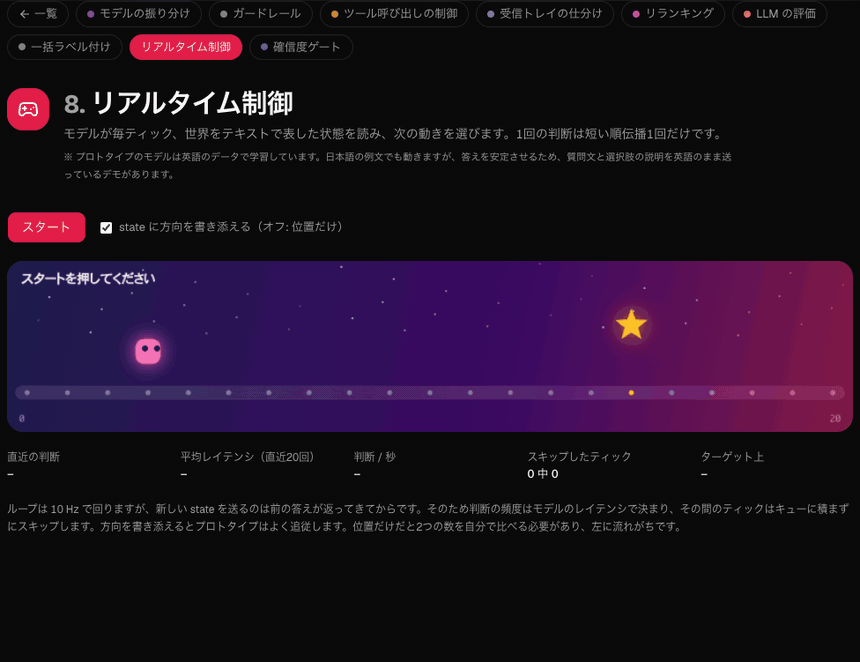

**9. 確信度ゲート**: 確かなら実行、迷うなら確認、それ以外は人に回します。

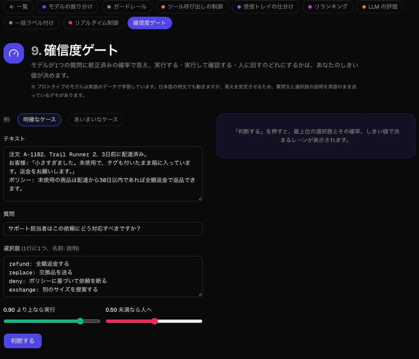

**10. 写真チェック**: 配達写真から、荷物の破損と置き場所を確認します。

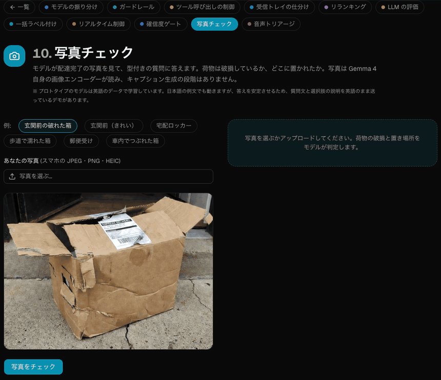

**11. 音声トリアージ**: ドライバーの音声メモから、用件と緊急かどうかを聞き取ります。

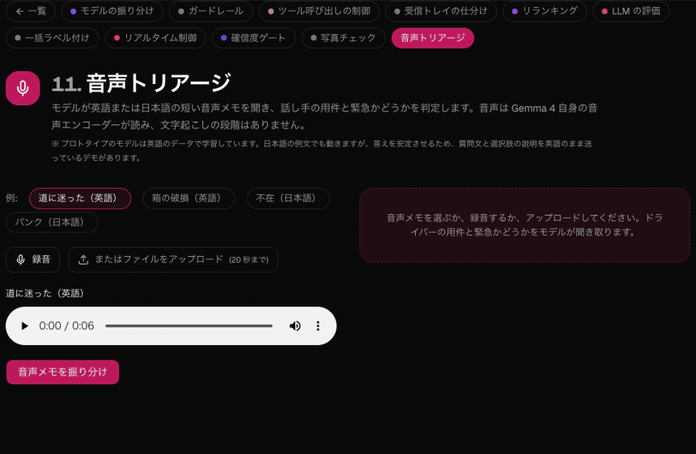

**12. PR ラベル付け**: すべてのプルリクエストに、変更の種類・影響範囲・深刻度のラベルを付けます。

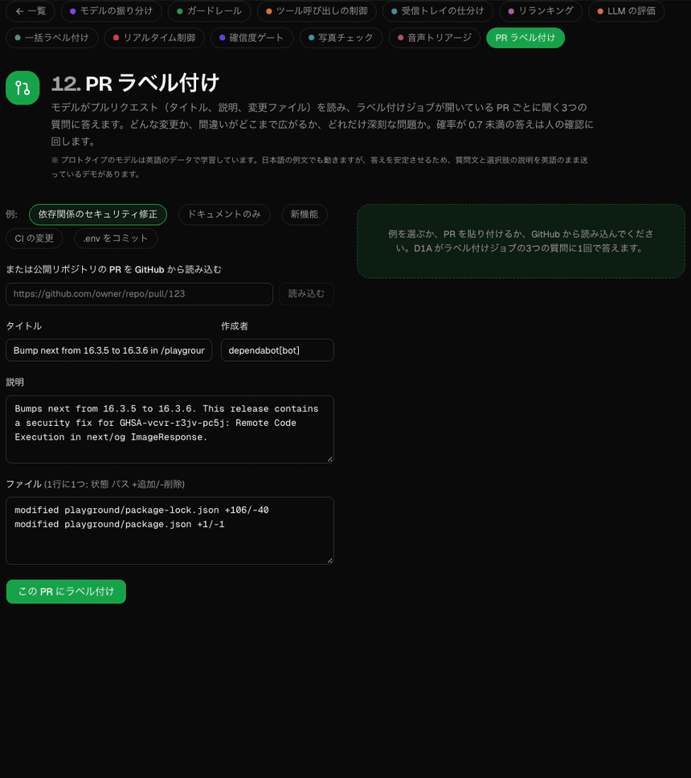

**13. 動画チェック**: 短い配達動画から、荷物の破損と置き場所を確認します。モデルは動画全体から均等に選んだ 16 フレームを、それぞれのタイムスタンプ付きで Gemma 4 自身の画像エンコーダーで読みます。音声は使いません。答えるのは場面全体について（写真と同じくゼロショット）で、出来事の順番に関する質問（「最後はどこにあるか」など）にはまだ安定して答えられません。Mac では 1 本あたり 10〜20 秒かかります。

## クイックスタート

[git](https://git-scm.com/downloads)、[Node.js](https://nodejs.org) 20.9 以上、[uv](https://docs.astral.sh/uv/) が必要です。Python は不要です（なければ uv が Python 3.13 を取得します）。スクリプトがすべて確認し、足りないものを教えてくれます。

**macOS、Linux、WSL**

```bash
git clone https://github.com/jonpol01/d1a-playground.git && cd d1a-playground
./demo.sh
```

**Windows（PowerShell）**

```powershell
git clone https://github.com/jonpol01/d1a-playground.git; cd d1a-playground
powershell -ExecutionPolicy Bypass -File .\demo.ps1
```

スクリプトは D1A のモデルサーバーを `.demo/venv` にインストールし（[jonpol01/d1a](https://github.com/jonpol01/d1a) のコミットに固定）、ポート 8009 で起動し、Web アプリをポート 3001（使用中なら 3011、3021〜3030）で起動してブラウザを開きます。Apple Silicon では 8 ビットの MLX 版（`JohnP1/d1a-e2b-mlx-q8`、ダウンロード約 4 GB、メモリ 3 GB）を、それ以外では PyTorch のチェックポイント `JohnP1/d1a-e2b`（Gemma 4 E2B 約 10 GB をダウンロード）を使います。初回は Python パッケージ約 1 GB もダウンロードし、2回目以降は数秒で起動します。`--media` を付けると、写真チェックと音声トリアージ用の写真・音声サーバーも起動します（最初の写真または音声のリクエストでモデル約 10 GB を読み込みます）。`MODEL_RUN` で別のチェックポイントを選べます（例: `MODEL_RUN=JohnP1/d1a-e4b-mlx-q8@v0.2-hybrid`）。ログは `.demo/` に出ます。Ctrl+C ですべて止まります。ターミナルを閉じてしまった場合は `./demo.sh stop`（または `.\demo.ps1 stop`）で止められます。

### 写真チェックと音声トリアージ

この2つのデモは、写真や音声に対して同じ形の質問をします。Web アプリは `/media/*` を `MEDIA_API` に転送します。プレイグラウンドは `./demo.sh --media` で起動してください。

- **Apple Silicon では**、モデルサーバー自身が同じモデルで答えます。Gemma 4 自身の画像・音声エンコーダー（約 1 GB、最初の写真・音声リクエストで取得）が写真や音声をトークンに変え、それを D1A のモデルが読みます。MLX 版の `JohnP1/d1a-e2b-mlx-q8` と `JohnP1/d1a-e4b-mlx-q8@v0.3` にはエンコーダーが入っています。
- **それ以外（PyTorch）では**、[jonpol01/d1a](https://github.com/jonpol01/d1a) の2つ目のサーバー `d1a.serving.media` がポート 8010 で動き、最初のリクエストでエンコーダー付きの Gemma 4（bf16、約 10 GB）を読み込みます。

チェックポイントはテキストだけで学習しているため、これらの答えはゼロショットです。サンプル写真6枚では、D1A-E2B は破損の判定が6枚中4枚、置き場所が6枚中5枚で正しく（郵便受けを宅配ロッカーと答えます）、D1A-E4B v0.3 はそれぞれ6枚中5枚と6枚中6枚です。サンプルの音声メモ4つはどちらもすべて正しく聞き取りました。音声のサンプルは Qwen3-TTS で作りました。自分で録音するにはマイクの許可が必要で、ブラウザが許可するのは `localhost` か https の場合だけです。

### モデルの中身

`/architecture` ページと同じ図です（[jonpol01/d1a](https://github.com/jonpol01/d1a#how-it-works) の `docs/arch/make_svgs.py` で生成）。

**入力。** 文書を最初に1回だけ置き、続けて質問ごとに1つの枝を置きます。`<q>` と指示文、選択肢ごとの `<opt> … </opt>`、最後に `<decide>` です。位置 ID は質問ごとにリセットされるので、各質問は単独で読んだときと同じものを見ます。

<picture>
  <source media="(prefers-color-scheme: dark)" srcset="docs/arch/layout-dark.svg">
  、選択肢、<decide>" width="100%">
</picture>

**モデル。** Gemma 4 のバックボーンに LoRA アダプターを載せ、小さなポインターヘッドが各選択肢の `</opt>` を質問の `<decide>` と照らし合わせて点数を付けます。検証用データで求めた温度で確率を較正します。

<picture>
  <source media="(prefers-color-scheme: dark)" srcset="docs/arch/model-dark.svg">
  
</picture>

**同じ答えを出す2つの実行方法。** Packed はリクエスト全体をブロック因果マスクの下で1本の系列として計算し、Rows は文書を1回だけプレフィックスキャッシュに読み込んでから、質問ごとに短い行を計算します。

<picture>
  <source media="(prefers-color-scheme: dark)" srcset="docs/arch/forms-dark.svg">
  
</picture>

**どこで動くか。** すべてのデモが `d1a.serving.serve` を呼びます。写真チェックと音声トリアージでは、Gemma 4 自身の画像・音声エンコーダーが写真や音声メモをトークンに変え、同じモデルがそれを読みます。キャプション生成や音声認識の段階はありません。

<picture>
  <source media="(prefers-color-scheme: dark)" srcset="docs/arch/serving-dark.svg">
  
</picture>

## 画面

UI は既定で日本語で、ヘッダーの JA / EN で切り替えられます。選択はブラウザに保存され、URL の `?lang=en` または `?lang=ja` が優先されます。日本語モードでは例文も日本語です。プロトタイプのモデルは英語のデータで学習しているため、日本語の文言では答えが弱い、または不安定だったデモでは、読む文章は日本語のまま、質問文と選択肢の説明を英語で送っています（どのデモがそうかは各ファイルに書いてあります）。ヘッダーの下のハードウェアモニターには、バックエンド、リクエストごとのレイテンシとその推移、スループット、モデルサーバーのマシンの GPU 使用率・メモリ・負荷が表示されます（`GET /api/hw` が `ioreg`、`footprint`、`memory_pressure`、`nvidia-smi` など権限不要のコマンドで取得します）。`/architecture` ではモデルの仕組みを説明しています。

## Mac で常時稼働させる

`mini.sh` はプレイグラウンドを常時稼働のサービスとして動かします。モデルサーバーと Web アプリの本番ビルドを2つのユーザー LaunchAgent（`io.github.jonpol01.d1a-model` と `io.github.jonpol01.d1a-web`）として登録し、ログイン時に起動し、クラッシュしても再起動します。[Homebrew](https://brew.sh) の `node` と `uv` が必要です。

```bash
git clone https://github.com/jonpol01/d1a-playground.git ~/d1a-playground && cd ~/d1a-playground
./mini.sh install    # モデルサーバーを .demo/venv に入れ、npm ci とビルドをして、LaunchAgent を書いて読み込む
./mini.sh status     # 読み込まれているか、両方のポートが応答するか
./mini.sh stop       # 両方を止める。./mini.sh start で再開
./mini.sh update     # git pull、再インストール、再ビルド、再起動
```

ログは `~/Library/Logs/d1a-model.log` と `~/Library/Logs/d1a-web.log` です。設定は `install` と `update` が読み、`.demo/mini.env` に保存します。`KEV_PORT`（8009）、`PORT`（3031）、`HOST`（127.0.0.1。LAN に直接公開するなら 0.0.0.0）、`D1A_BASE_PATH`（空）、MPS のメモリ上限 `PYTORCH_MPS_HIGH_WATERMARK_RATIO` / `PYTORCH_MPS_LOW_WATERMARK_RATIO`（0.7 / 0.6。他の用途にも使う 32 GB の Mac 向けの値です。スワップさせずに早めに失敗させたいときは下げてください）、モデルサーバーの長い state のキャッシュ `KEV_PREFIX_CACHE` / `KEV_PREFIX_MAX_TOKENS`（4 / 65536）。モデルサーバーは常に 127.0.0.1 だけで待ち受けます。LaunchAgent はユーザーがログインしている間だけ動くので、再起動後に自動で戻したい場合は自動ログインを有効にしてください。インストールには uv の設定がそのまま効きます（TLS を検査するネットワークでは `UV_SYSTEM_CERTS=1`、既定のキャッシュに書き込めないときは `UV_CACHE_DIR`）。

**ディスクに余裕がないときのモデルの切り替え。** 一部の重みだけが変わった新しいモデルは古いモデルとファイルを共有します（v0.5 → v0.6 のダウンロードは 7.5 GB のうち 4.9 GB）。ダウンロードの前に、Hub で 2 つのリビジョンの LFS の sha256 を比べてください。新しいモデルが動いてスモークテストに通るまで、古いバージョンはキャッシュに残します。両方が入らないときは、サーバーを止め、古いバージョンにしかないファイルだけを削除し、ダウンロードして全ファイルの sha256 を Hub と照合してから `./mini.sh reinstall` を実行し、そのマシンでベースラインを記録します。ロールバックは `MODEL_RUN=<repo>@<旧タグ>` で再インストールすることで、削除したファイルは再ダウンロードされます。Mac mini の Hugging Face キャッシュは実データを共有ストア `~/.cache/huggingface/hub/blobs/<xx>/<hash>` にシンボリックリンク経由で置いているため、リポジトリの `blobs/<sha256>` を消しても容量は空きません。`~/.cache` 以下のシンボリックリンクから参照されていないことを確かめてから、共有ストアのファイルを削除してください。

**モデルは必要なときに読み込みます。** モデルサーバーは、リクエストが `IDLE_UNLOAD` 秒（600。`0` で常に読み込んだまま）来ないとモデルを解放し、次のリクエストで数秒かけて読み込み直します。メモリに載っているかどうかは `./mini.sh status` で分かります。

**写真チェックと音声トリアージ。** `.demo/mini.env` に `MEDIA=1` と、画像・音声エンコーダーを含む `MODEL_RUN`（`JohnP1/d1a-e4b-mlx-q8@v0.3` か `JohnP1/d1a-e2b-mlx-q8`）を設定し、`./mini.sh reinstall` を実行してください。同じモデルサーバーの同じモデルが答えます。エンコーダー（約 1 GB）は最初の写真・音声リクエストで読み込まれ、モデルと一緒に解放されます。`MEDIA=0` にすると使いません（以前の版は2つ目のモデルを持つ3つ目の LaunchAgent `io.github.jonpol01.d1a-media` を動かしていました。`install` と `reinstall` がそれを取り除きます）。

**リバースプロキシの下、サブパスで公開する場合。** `D1A_BASE_PATH=/d1a` でビルドすると（例: `D1A_BASE_PATH=/d1a ./mini.sh install`）、ページ、アセット、モデル API のプロキシ（`/d1a/kev/...`）、`/d1a/api/hw` のすべてが `/d1a` の下で提供されます。プロキシでは `/d1a` で始まるパスを、パスを変えずに `http://127.0.0.1:3031` に転送してください（例: `http://<your-mac-ip>/d1a`）。`next build` と `next start` の両方に同じ `D1A_BASE_PATH` が必要です（mini.sh は両方に設定します）。`.demo/mini.env` を書き換えたら `./mini.sh update` で反映します。

## 必要なもの・制限事項・トラブルシューティング

メモリや速度の目安、LM Studio モード、制限事項、トラブルシューティング、開発手順は [README.md](README.md)（英語）を参照してください。要点: モデルサーバーはアイドル時に約 12 GB、ピーク時に約 15 GB のメモリを使います（M1 Max 64 GB で計測）。チェックポイントは英語データで学習した1エポックのプロトタイプです。

## リリース

バージョンは [セマンティック バージョニング](https://semver.org/lang/ja/) に従い、[GitHub](https://github.com/jonpol01/d1a-playground/releases) で公開します。各バージョンの変更点は [CHANGELOG.md](CHANGELOG.md)（英語）にあります。リリースの手順: CHANGELOG.md にそのバージョンの節を手で書き、`package.json` に同じバージョンを設定し（`npm version X.Y.Z --no-git-tag-version`）、マージしてからタグ `vX.Y.Z` を push します。CI が3つの一致を確認し、アプリをビルドして、その節を本文にしたリリースを公開します。

## クレジットとライセンス

- Jared Palmer による [Kev](https://github.com/jaredpalmer/kev)（Apache-2.0）: モデルの構造、学習と配信のコード、System One API のクライアント、このアプリの元になったプレイグラウンド。変更して取り込んだファイルにはその旨のヘッダーがあり、[NOTICE](NOTICE) に一覧があります。
- Google による [Gemma 4](https://huggingface.co/google/gemma-4-E2B)（Apache-2.0）: チェックポイントのベースモデル。
- このプレイグラウンド、Kev の Gemma 4 対応、[JohnP1/d1a-e2b](https://huggingface.co/JohnP1/d1a-e2b) チェックポイント: John Soliva（[jonpol01](https://github.com/jonpol01)）。

Apache License 2.0 で提供しています。[LICENSE](LICENSE) と [NOTICE](NOTICE) を参照してください。
