# D1A playground — thirteen use cases

[日本語](README.ja.md)

A small decision model reads one document, answers a few typed questions about it, and returns a probability for every option. This playground runs thirteen real jobs on that idea, live, on your own machine: routing prompts to a model tier, blocking prompt injections, gating an agent's tool calls, triaging an inbox, reranking search results, grading LLM answers, labelling a table, steering a robot in real time, deciding when to act and when to ask a human, and, from a photo, a voice note or a short video, checking a delivery for damage and triaging a driver's message, and labeling pull requests. Every example is editable, and every answer shows the full probability distribution behind it.

D1A is built on [Kev](https://github.com/jaredpalmer/kev) by Jared Palmer (Apache-2.0). D1A is not affiliated with or endorsed by Jared Palmer or the Kev project. The playground serves D1A-E2B v0.1, a one-epoch model on Gemma 4 E2B ([JohnP1/d1a-e2b](https://huggingface.co/JohnP1/d1a-e2b), tag `v0.1-1epoch`; formerly JohnP1/kev-gemma4-e2b), trained with the Gemma 4 support in the fork [jonpol01/kev](https://github.com/jonpol01/kev).


## The Thirteen Demos

| # | Demo | What the model decides | Example answer from the live prototype |
|---|---|---|---|
| 1 | Model routing | How hard a prompt is: `small`, `medium` or `large` model, with an illustrative cost per 1,000 requests | "What's the capital of Australia?" → small (0.73); a replication-lag debugging question → large (0.70) |
| 2 | Guardrails | The message category (`safe`, `prompt_injection`, `abuse`, `off_policy`) and whether it should reach the LLM → ALLOW or BLOCK | "Ignore previous instructions…" → prompt_injection (0.59), BLOCK; a homework request → off_policy (0.98), BLOCK |
| 3 | Tool-call gating | `allow`, `ask` or `deny` for an agent's proposed tool call | `read_file` → allow (0.65); `rm -rf ~/` → deny (0.81); `send_email` to all staff → ask (0.49) |
| 4 | Inbox triage | `reply_now`, `later` or `archive` for each of eight emails, sorted | the production outage and the manager's deadline on top; the receipt and the flight sale archived |
| 5 | Reranking | p(this passage answers the query) for six passages, re-sorted | the "recover with phone" passage moves from #3 to #1 (0.77) |
| 6 | LLM evals | A 1–5 grade for an LLM answer, with the whole distribution | correct answer 4.7 / 5; wrong answer 3.0 / 5, spread across levels |
| 7 | Bulk labeling | `positive`, `neutral` or `negative` for 30 product reviews, with a p(label) column | 30 rows in 7–13 s at 3 requests in flight; the two rows below 0.60 are flagged for a human |
| 8 | Real-time control | `left`, `right` or `stay` for a robot chasing a target, every tick | 2–3 decisions per second at 250–450 ms each; ticks in between are skipped, never queued |
| 9 | Confidence gate | One question; your two thresholds put the answer in *act*, *act and confirm* or *send to a human* | a clear refund → refund (0.75), confirm lane; an ambiguous one → replace (0.41), human lane |
| 10 | Photo check | From a delivery photo: is the parcel damaged (`noul`), and where was it left (five places) | a wet, torn box on a sidewalk → damaged (0.89), on a sidewalk (0.78); the locker photo → 0.57, "check by hand" |
| 11 | Voice triage | From a short voice note, EN or JA, with no speech-to-text: is it urgent, and what does the speaker need | 「高速道路でタイヤがパンクしました…」 → urgent (0.77), a vehicle problem (0.71); a lost driver → routine (p(urgent) 0.30), directions to the address |
| 12 | PR labeler | From a pull request's title, description and files: change type (7), blast radius (4) and severity (P0–P4), the questions a labeling job asks on every open PR; answers below p 0.7 add `review:needs-human` | a Next.js RCE fix from Dependabot → type/security, P0 (0.48, so flagged for a human); a docs-only PR → type/docs, P4 |
| 13 | Video check | From a short clip, 16 frames each with its timestamp, no captioning: the Photo check questions (damaged? where was it left?) about the whole scene | a pan over the wet box on a sidewalk → on a sidewalk (0.89), damaged 0.67 so "check by hand"; the door drop → at a front door (0.83), damaged 0.11 |

The numbers are from runs on an M1 Max; yours will differ a little. Each demo has its own picture of the answer (a lit route, a shield, a traffic light, inbox trays, sliding search results, stars, a progress ring, a little arcade robot, a slider track), and the probability bars stay underneath it. Screenshots of every demo, in light mode plus one on a phone in dark mode, are in [docs/screenshots](docs/screenshots).

### Each Demo Running

Short recordings of the live prototype in dark mode, with the page in English: each one picks an example, presses the button and shows the answer with its probabilities. The recordings are from one run; yours will differ a little.

**1. Model routing**

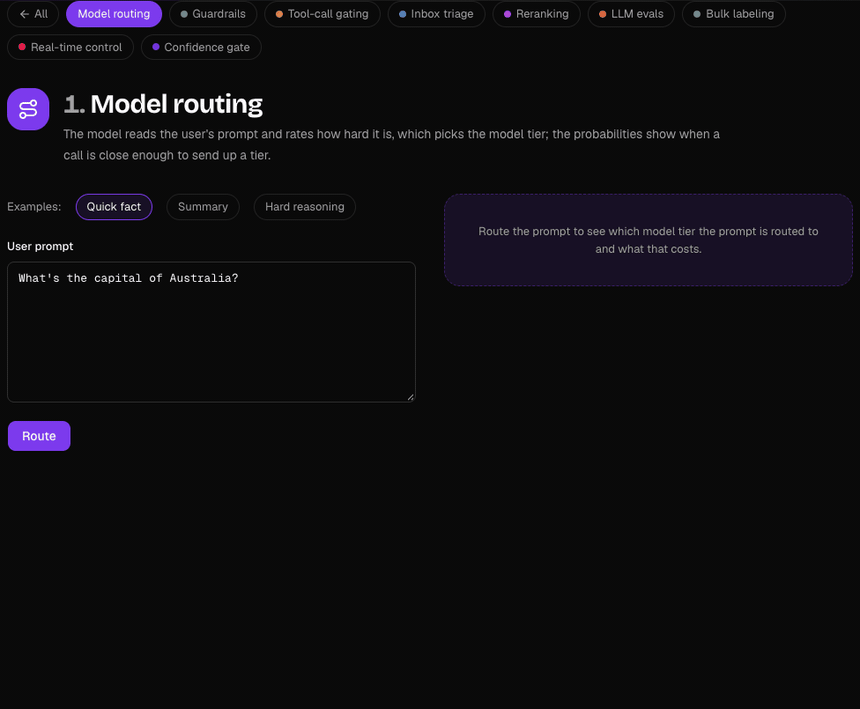

**2. Guardrails**

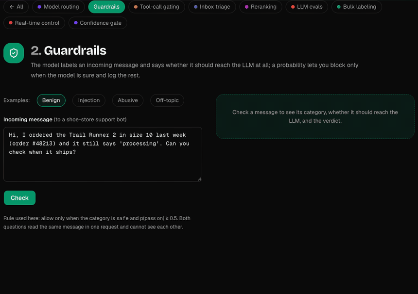

**3. Tool-call gating**

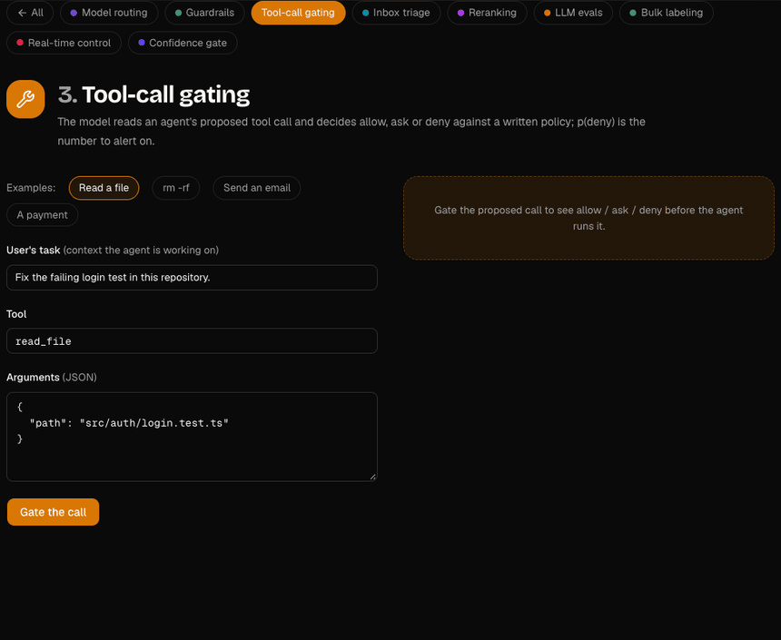

**4. Inbox triage**

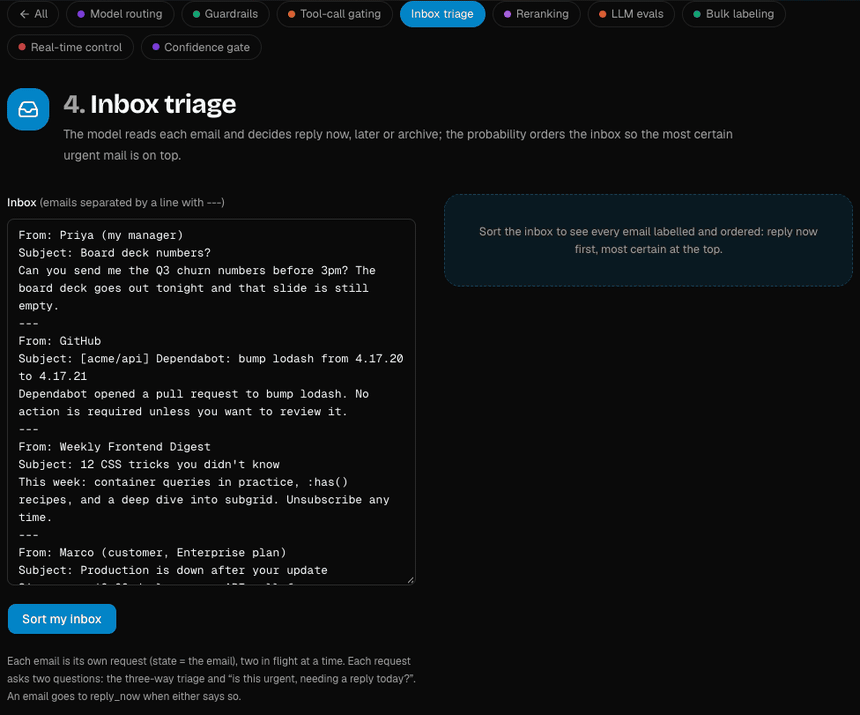

**5. Reranking**

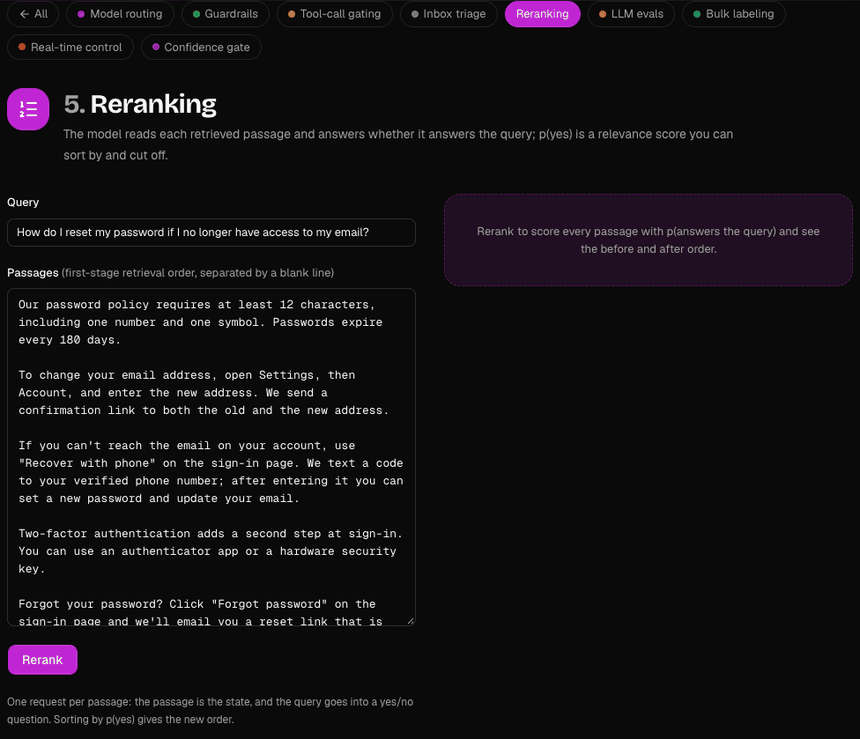

**6. LLM evals**

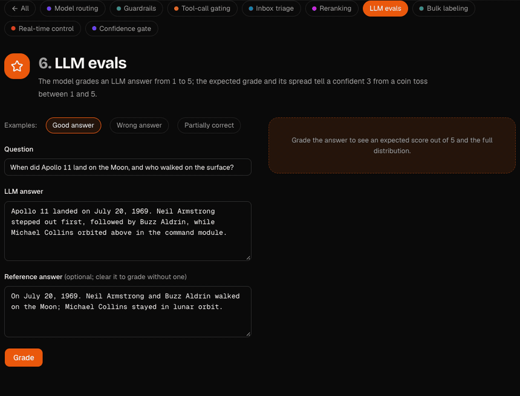

**7. Bulk labeling**

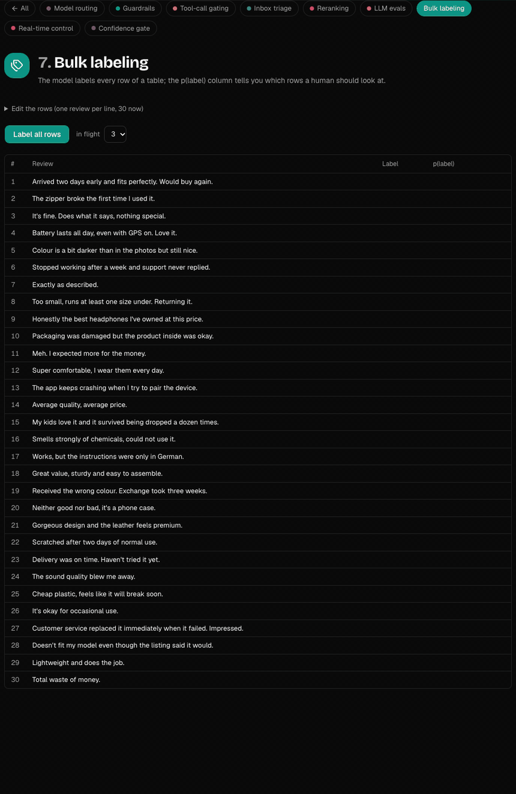

**8. Real-time control**

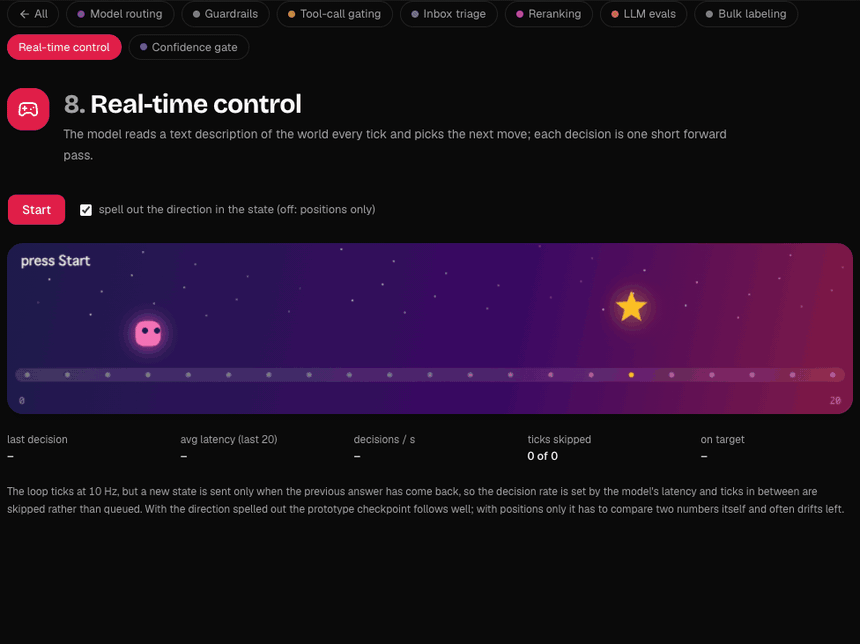

**9. Confidence gate**

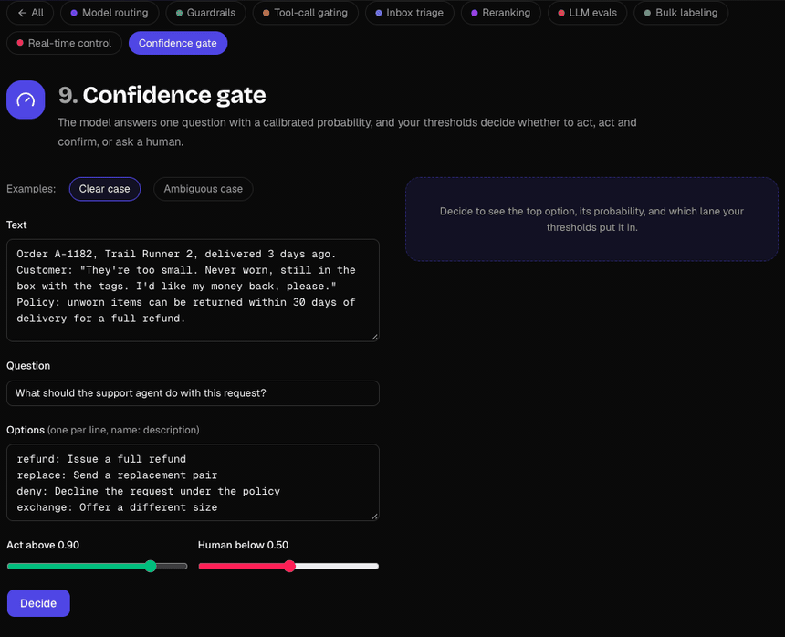

**10. Photo check**

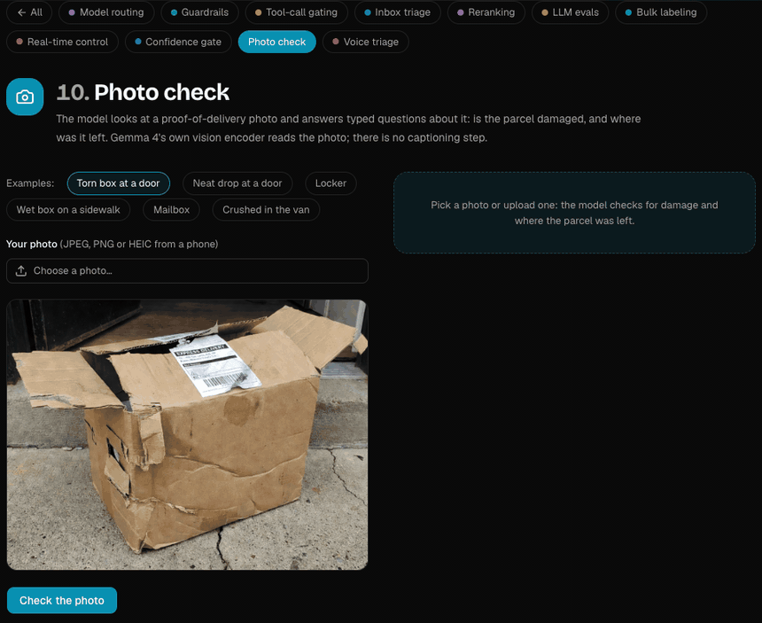

**11. Voice triage**

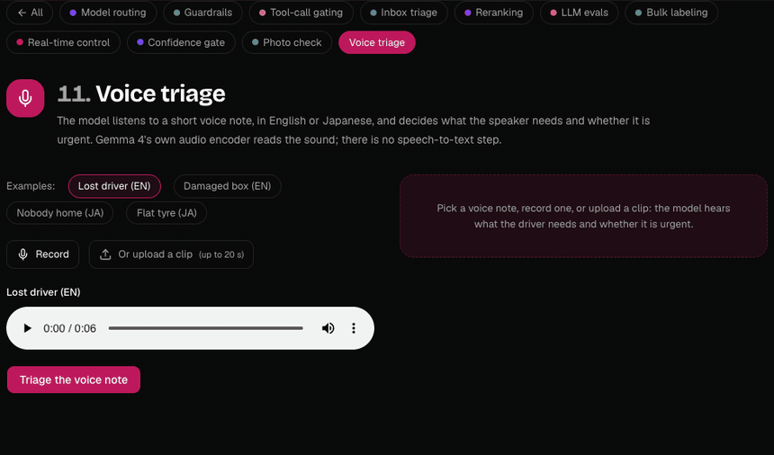

**12. PR labeler**

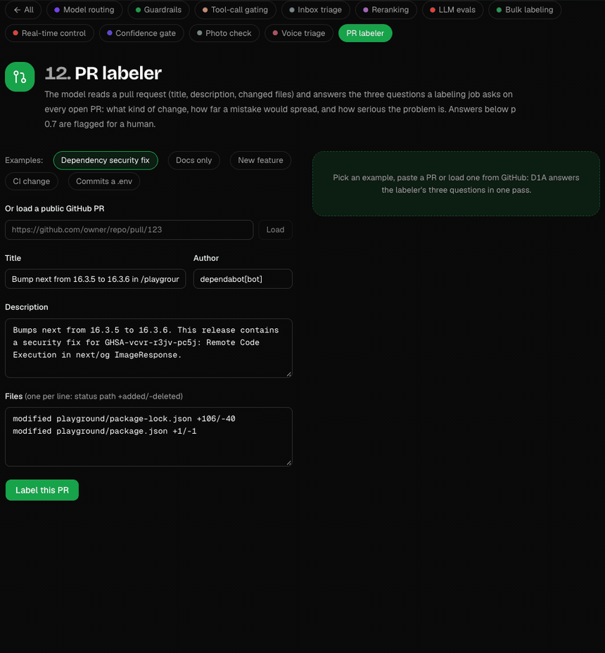

**13. Video check**: the Photo check questions about a short clip. The model reads 16 frames spread over the clip, each with its timestamp, through Gemma 4's own vision encoder; the sound is not used. It answers about the scene as a whole (zero-shot, like the photos); questions about the order of events ("where is it at the end?") are not reliable yet. A clip takes 10–20 s on a Mac.

## Quick Start

You need [git](https://git-scm.com/downloads), [Node.js](https://nodejs.org) 20.9 or newer and [uv](https://docs.astral.sh/uv/). You don't need Python: uv fetches Python 3.13 if it is missing. The scripts check all of this and say what to install.

**macOS, Linux, WSL**

```bash
git clone https://github.com/jonpol01/d1a-playground.git && cd d1a-playground
./demo.sh
```

**Windows (PowerShell)**

```powershell
git clone https://github.com/jonpol01/d1a-playground.git; cd d1a-playground
powershell -ExecutionPolicy Bypass -File .\demo.ps1
```

The script installs the D1A model server into `.demo/venv` (from [jonpol01/d1a](https://github.com/jonpol01/d1a), pinned to a commit), starts it on port 8009, starts the web app on port 3001 (or 3011, or 3021–3030 if those are busy), and opens your browser. On Apple Silicon it serves the 8-bit MLX build (`JohnP1/d1a-e2b-mlx-q8`, about 4 GB to download, 3 GB of memory); elsewhere the PyTorch checkpoint `JohnP1/d1a-e2b`, which downloads Gemma 4 E2B (about 10 GB). The first run also downloads about 1 GB of Python packages; after that a start takes seconds. Add `--media` to also start the photo and voice server for Photo check and Voice triage (it loads its model, about 10 GB, on the first photo or voice request). `MODEL_RUN` picks another checkpoint, for example `MODEL_RUN=JohnP1/d1a-e4b-mlx-q8@v0.2-hybrid`. Logs go to `.demo/`. Ctrl+C stops everything, and `./demo.sh stop` (or `.\demo.ps1 stop`) stops a run whose terminal you closed.

### Photo Check and Voice Triage

These two demos ask the same questions about a photo or a voice clip; the web app forwards `/media/*` to `MEDIA_API`. Start the playground with `./demo.sh --media`:

- **On Apple Silicon** the model server answers them itself, with the same model: Gemma 4's own vision and audio encoders (about 1 GB, fetched on the first photo or voice request) turn the media into tokens the D1A model reads. The MLX builds `JohnP1/d1a-e2b-mlx-q8` and `JohnP1/d1a-e4b-mlx-q8@v0.3` carry them.
- **Elsewhere (PyTorch)** they run on a second server, `d1a.serving.media` from [jonpol01/d1a](https://github.com/jonpol01/d1a), which loads Gemma 4 with its encoders (bf16, about 10 GB) on the first such request, on port 8010.

The checkpoint is trained on text only, so these answers are zero-shot: on the six sample photos D1A-E2B judges damage right on 4 of 6 and the drop-off place on 5 of 6 (it calls the mailbox a locker), D1A-E4B v0.3 on 5 of 6 and 6 of 6, and both read all four sample voice notes right. The voice samples were made with Qwen3-TTS; recording your own needs microphone access, which browsers allow on `localhost` or https only.

Other options: `--no-server` uses a model server that is already running on port 8009, `--no-browser` skips opening the browser, `KEV_PORT` and `PORT` change the two ports.

## Requirements

Measured on an M1 Max with 64 GB of memory:

- **Download:** about 10 GB on the first run (Gemma 4 E2B) plus the small adapter, and about 1 GB of Python packages (more on Linux and Windows with CUDA).
- **Memory:** the model server uses about 12 GB when idle and about 15 GB at its peak (no swap). A 16 GB machine is tight; with less, use LM Studio mode below.
- **Speed:** ready about 16 seconds after the download; a request with six questions takes 0.4–1 s, and a single question about 0.25–0.7 s.
- **Hardware:** an NVIDIA GPU is used automatically (the scripts install the CUDA build of PyTorch when a driver is present). On Apple Silicon the model runs on the GPU through PyTorch MPS, and the scripts cap PyTorch's share of unified memory (`PYTORCH_MPS_HIGH_WATERMARK_RATIO=0.5` and `PYTORCH_MPS_LOW_WATERMARK_RATIO=0.4`; the low mark is needed because PyTorch refuses a high mark below its default low of 1.4). CPU-only machines work, but each request takes seconds.

## How It Works

The browser talks only to the web app, a Next.js app that forwards `/kev/*` to the model server (`KEV_API`, default `http://127.0.0.1:8009`), so there is no CORS setup. The model server is `d1a.serving.serve`, which implements TypeSafe's System One API: `POST /v1/systemone` with one `state` (the document: text or JSON) and a set of typed questions, `choice` (named options with descriptions), `noul` (yes/no) and `score` (ordered levels).

It is not a chat model. The checkpoint is a LoRA adapter and a pointer head on Gemma 4 E2B: it reads the state once, answers every question in the same forward pass without letting the questions see each other, and reads a probability for each option directly off the pointer head, with a temperature fitted on held-out data so the probabilities are calibrated. No text is generated, so there is nothing to parse and no format to break.

Everything the demos do with the answers (route, block, sort, grade, move a robot, pick a lane) is plain code in [src/components/uses](src/components/uses). Each demo's questions are in the same files, so you can see exactly what the model was asked. The batch demos send one request per item, a few in flight at a time; the control loop sends a new state only when the previous answer has come back.

### Inside the Model

The same diagrams as the `/architecture` page, from [jonpol01/d1a](https://github.com/jonpol01/d1a#how-it-works) (generated by its `docs/arch/make_svgs.py`).

**The input.** The document comes first, once; each question follows as its own branch, `<q>` and the instructions, one `<opt> … </opt>` span per option, then `<decide>`. Position ids restart for every question, so each question sees exactly what it would see alone.

<picture>
  <source media="(prefers-color-scheme: dark)" srcset="docs/arch/layout-dark.svg">
  , the options and <decide>" width="100%">
</picture>

**The model.** A Gemma 4 backbone with a LoRA adapter, and a small pointer head that scores each option's `</opt>` against the question's `<decide>`. A temperature fitted on held-out data makes the probabilities calibrated.

<picture>
  <source media="(prefers-color-scheme: dark)" srcset="docs/arch/model-dark.svg">
  
</picture>

**Two ways to run it, same answers.** Packed runs the whole request as one sequence under a block-causal mask; rows reads the document once into a prefix cache and runs each question as its own short row.

<picture>
  <source media="(prefers-color-scheme: dark)" srcset="docs/arch/forms-dark.svg">
  
</picture>

**Where it runs.** Every demo calls `d1a.serving.serve`. For Photo check and Voice triage, Gemma 4's own vision and audio encoders turn the photo or voice note into tokens the same model reads, so there is no captioning or speech-to-text step.

<picture>
  <source media="(prefers-color-scheme: dark)" srcset="docs/arch/serving-dark.svg">
  
</picture>

## LM Studio Mode (Not the Trained Model)

For machines without the memory for the model server, both scripts can point the playground at a chat model in [LM Studio](https://lmstudio.ai) instead:

```bash
./demo.sh --lmstudio http://127.0.0.1:1234                                      # macOS: gemma-4-e4b-it-mlx by default
./demo.sh --lmstudio http://127.0.0.1:1234 --lmstudio-model <id from /v1/models>   # Windows and Linux ids have no -mlx suffix
```

This runs [server/lmstudio_systemone.py](server/lmstudio_systemone.py), which asks each question as its own prompt and turns the chat model's letter probabilities into the same answer shape. **It is prompted Gemma, not the trained checkpoint:** no adapter, no pointer head, no calibration, and one chat request per question. The page shows a banner while it is in this mode. Start LM Studio's server (Developer tab) and load a Gemma 4 model first; the script lists the Gemma models it finds if the id doesn't match.

## Limitations

- The checkpoint is a **one-epoch prototype**. On the development partitions of Kev's suites it scores 0.794 on trained sources and 0.569 on new sources, against 0.817 and 0.622 for Kev's two-epoch Qwen3.5-0.8B base recipe (one epoch against two, so not like for like). The [model card](https://huggingface.co/JohnP1/d1a-e2b) has the details.
- It was trained on English data. Other languages are untested in these demos.
- Question wording matters. Some demos use the wording that worked best with this prototype, and the files say so: the inbox adds a yes/no urgency question because the three-way choice alone under-calls urgent mail; the control loop's state spells out which way the target is, because with positions alone the prototype drifts left (tick the box off in the demo to see it).
- Several answers are close calls (0.4–0.6). That is the point of showing probabilities: the demos route, flag or hand those to a human instead of pretending to be sure.

## Troubleshooting

- **"The model server is not answering"**: the server is not running or is still downloading. Check `.demo/model-server.log`, or run `./demo.sh` again.
- **Port busy**: port 8009 must be free or already running a D1A server; the web app picks the first free port of 3001, 3011, 3021–3030. Set `KEV_PORT` or `PORT` to use others.
- **Out of memory, or the machine swaps hard**: close other apps, or use `--lmstudio`. On Apple Silicon the scripts already cap PyTorch's memory; a lower `PYTORCH_MPS_HIGH_WATERMARK_RATIO` makes it fail earlier instead of swapping.
- **The page loads but buttons do nothing**: open `http://localhost:<port>`, not `127.0.0.1` or a LAN address. The Next.js dev server only hydrates the pages for hostnames it trusts (`allowedDevOrigins` in `next.config.ts`).
- **Windows says scripts are disabled**: run it as `powershell -ExecutionPolicy Bypass -File .\demo.ps1`.
- **Slow on a PC with an NVIDIA GPU**: check the `serving ... on <device>` line in `.demo/model-server.log`. If it says `cpu`, delete `.demo/venv` and run the script again after updating the NVIDIA driver, so uv picks the CUDA build of PyTorch.

## The Page

The UI is in Japanese by default, with an EN / JA switch in the header; the choice is remembered in the browser, and `?lang=en` or `?lang=ja` in the URL overrides it. In Japanese mode the examples are Japanese. The prototype model was trained on English data, so some demos keep their questions and option descriptions in English while the text they read is Japanese: with Japanese wording those demos gave weaker or less stable answers (the file of each demo says which). A hardware monitor under the header shows the backend, the latency of each request with a sparkline, throughput, and the model server machine's GPU use, memory and load (from `GET /api/hw`, which runs a few unprivileged commands such as `ioreg`, `footprint`, `memory_pressure` or `nvidia-smi`). `/architecture` explains how the model works.

## Self-hosting on a Mac

`mini.sh` runs the playground as an always-on service: the model server and a production build of the web app as two user LaunchAgents (`io.github.jonpol01.d1a-model` and `io.github.jonpol01.d1a-web`) that start at login and restart after a crash. On Apple Silicon the model server runs [JohnP1/d1a-e2b-mlx-q8](https://huggingface.co/JohnP1/d1a-e2b-mlx-q8) on MLX (about 4 GB of memory); elsewhere the PyTorch checkpoint JohnP1/d1a-e2b. Set `MODEL_RUN=JohnP1/d1a-e4b-mlx-q8` in `.demo/mini.env` for the larger, more accurate E4B (about 6.5 GB), then `./mini.sh reinstall`. It needs [Homebrew](https://brew.sh) `node` and `uv`.

```bash
git clone https://github.com/jonpol01/d1a-playground.git ~/d1a-playground && cd ~/d1a-playground
./mini.sh install    # D1A model server into .demo/d1a-venv, npm ci + build, write and load the LaunchAgents
./mini.sh status     # what is loaded and whether both ports answer
./mini.sh stop       # unload both;  ./mini.sh start loads them again
./mini.sh update     # git pull, reinstall, rebuild, restart
```

`reinstall` (and `update`, which runs it after the pull) installs the model server and writes the LaunchAgents while the old version keeps serving, and stops the agents only after both succeed. A failed download or install therefore leaves the running version up. If the web build or the start fails after the stop, the agents start again on whatever is installed.

After `install`, `reinstall` and `update`, and on `./mini.sh smoke`, the demo smoke test (`scripts/demo_smoke.mjs`) sends every demo's examples through the web app and stops on a demo that no longer answers or answers differently from `scripts/demo-baseline.json`. Record that baseline on the machine that serves (`node scripts/demo_smoke.mjs <url> --record` there): MLX rounds 8-bit matrix products differently per chip, enough to move a probability by 0.05 and flip an answer near a boundary. Its requests land in the model server's decision log like any other; they get no outcomes, so learning ignores them. Logs go to `~/Library/Logs/d1a-model.log` and `~/Library/Logs/d1a-web.log`. Settings are read by `install` and `update` and kept in `.demo/mini.env`: `KEV_PORT` (8009), `PORT` (3031), `HOST` (127.0.0.1; use 0.0.0.0 to serve the LAN directly), `D1A_BASE_PATH` (empty), and the MPS memory cap `PYTORCH_MPS_HIGH_WATERMARK_RATIO` / `PYTORCH_MPS_LOW_WATERMARK_RATIO` (0.7 / 0.6, sized for a 32 GB Mac that runs other things; lower them to fail early instead of swapping), and the model server's cache of long states `KEV_PREFIX_CACHE` / `KEV_PREFIX_MAX_TOKENS` (4 / 65536). Self-learning (D1A's `d1a.learning.feedback`) is off unless set: `FEEDBACK_LOG=<path>` logs every decision with a `decision_id` and takes real outcomes at `POST /v1/feedback`, and `OUTCOME_CALIBRATOR=<file>` applies a calibrator fitted on those outcomes (`python -m d1a.learning.feedback calibrate`), reloaded when the file changes. `LABEL_OUTCOMES=1` (with `FEEDBACK_LOG`) adds a LaunchAgent that runs `scripts/pr_outcomes.py` every 15 minutes. It reads the CTO bot's PR-labeling decisions from `/Users/Shared/d1a/labeler-decisions.jsonl` and posts their outcomes to the model server: the review bot's type and blast-radius labels on the head it reviewed (`src` reviewer), and any type, blast-radius or severity label a person changes (`src` human, which wins). It writes nothing to GitHub; its log is `~/Library/Logs/d1a-outcomes.log`. Each outcome carries `group` `<repo>#<number>`, so a PR's re-labelled decisions count as one piece of evidence. With `OUTCOME_CALIBRATOR` set as well, a second LaunchAgent (`io.github.jonpol01.d1a-promote`) runs D1A's promotion gate daily at 04:00 (`python -m d1a.learning.feedback promote <FEEDBACK_LOG> --calibrator <OUTCOME_CALIBRATOR>`). It writes the calibrator only for the questions whose outcomes show it helps, and the model server picks it up without a restart; until a question passes, the file need not exist. Its log is `~/Library/Logs/d1a-promote.log`. With `LABEL_OUTCOMES=1` the web app also serves the **PR label check** at `/review` (`/d1a/review` behind the proxy). It picks 50 pull requests whose labeler decision has a review-bot outcome: half where D1A and the reviewer disagree on type or blast radius, half where they agree, and the other half fills in while one is short. For each it shows the title, author, stats and the start of the body, D1A's and the reviewer's label per question, and for severity D1A's only. The person picks the correct label, or "unsure" to leave the reviewer's standing. Each answer goes to `POST /v1/feedback` as `src` human with the PR's `group`; the route sets both and accepts only sampled decisions and their own options. Progress (out of 50) is read back from the decision log, so it survives restarts. Only the shown fields leave the Mac; the smoke test checks the page and the route, read only. The model server always listens on 127.0.0.1 only. LaunchAgents run while the user is logged in, so turn on automatic login if the Mac must come back by itself after a reboot. uv keeps its cache in `.demo/uv-cache` unless `UV_CACHE_DIR` names another. Its other settings apply to the install too, for example `UV_SYSTEM_CERTS=1` on a network that inspects TLS.

**The model loads on demand.** The model server frees the model after `IDLE_UNLOAD` seconds without a request (600; `0` keeps it loaded) and loads it again on the next one, in a few seconds; `./mini.sh status` says whether it is in memory.

**Photo check and Voice triage.** Set `MEDIA=1` in `.demo/mini.env`, with a `MODEL_RUN` that carries the vision and audio encoders (`JohnP1/d1a-e4b-mlx-q8@v0.3`, or `JohnP1/d1a-e2b-mlx-q8`), and run `./mini.sh reinstall`. The same model server and the same model answer them: the encoders (about 1 GB) load on the first photo or voice request and are freed with the model. `MEDIA=0` leaves them out. (Earlier versions ran a third LaunchAgent, `io.github.jonpol01.d1a-media`, with a second model; `install` and `reinstall` remove it.)

**Behind a reverse proxy, under a sub-path.** Build with `D1A_BASE_PATH=/d1a` (for example `D1A_BASE_PATH=/d1a ./mini.sh install`) and the app serves everything under `/d1a`: pages, assets, the model API proxy (`/d1a/kev/...`) and `/d1a/api/hw`. Point the proxy's `/d1a` prefix at `http://127.0.0.1:3031` with the path unchanged, e.g. `http://<your-mac-ip>/d1a`. `next build` and `next start` both need the same `D1A_BASE_PATH` (mini.sh sets it for both), so change it with `./mini.sh update` after editing `.demo/mini.env`.

## Development

```bash
npm ci
KEV_API=http://127.0.0.1:8009 npm run dev      # with a model server already running
npm run lint && npx next typegen && npx tsc --noEmit -p .
```

## Releases

Versions follow [Semantic Versioning](https://semver.org) and are published on [GitHub](https://github.com/jonpol01/d1a-playground/releases); [CHANGELOG.md](CHANGELOG.md) says what changed in each one. To release: write the version's section in CHANGELOG.md by hand, set the same version in `package.json` (`npm version X.Y.Z --no-git-tag-version`), merge, then push the tag `vX.Y.Z`; CI checks that all three agree, builds the app and publishes the release with that section as its text.

## Credits and License

- [Kev](https://github.com/jaredpalmer/kev) by Jared Palmer, Apache-2.0: the model architecture, training and serving code, the System One API client and the playground this app started from. Files carried over and changed say so in a header; [NOTICE](NOTICE) lists them.
- [Gemma 4](https://huggingface.co/google/gemma-4-E2B) by Google, Apache-2.0: the base model under the checkpoint.
- This playground, the Gemma 4 support in Kev and the [JohnP1/d1a-e2b](https://huggingface.co/JohnP1/d1a-e2b) checkpoint: John Soliva ([jonpol01](https://github.com/jonpol01)).

Licensed under the Apache License 2.0; see [LICENSE](LICENSE) and [NOTICE](NOTICE).
