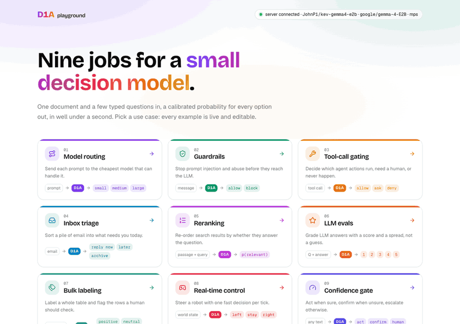

# D1A playground — nine use cases

A small decision model reads one document, answers a few typed questions about it, and returns a probability for every option. This playground runs nine real jobs on that idea, live, on your own machine: routing prompts to a model tier, blocking prompt injections, gating an agent's tool calls, triaging an inbox, reranking search results, grading LLM answers, labelling a table, steering a robot in real time, and deciding when to act and when to ask a human. Every example is editable, and every answer shows the full probability distribution behind it.

D1A is built on [Kev](https://github.com/jaredpalmer/kev) by Jared Palmer (Apache-2.0). D1A is not affiliated with or endorsed by Jared Palmer or the Kev project. Until the D1A models ship, the playground serves the Gemma 4 E2B prototype [JohnP1/kev-gemma4-e2b](https://huggingface.co/JohnP1/kev-gemma4-e2b), trained with the Gemma 4 support in the fork [jonpol01/kev](https://github.com/jonpol01/kev).



## The Nine Demos

| # | Demo | What the model decides | Example answer from the live prototype |
|---|---|---|---|
| 1 | Model routing | How hard a prompt is: `small`, `medium` or `large` model, with an illustrative cost per 1,000 requests | "What's the capital of Australia?" → small (0.73); a replication-lag debugging question → large (0.70) |
| 2 | Guardrails | The message category (`safe`, `prompt_injection`, `abuse`, `off_policy`) and whether it should reach the LLM → ALLOW or BLOCK | "Ignore previous instructions…" → prompt_injection (0.59), BLOCK; a homework request → off_policy (0.98), BLOCK |
| 3 | Tool-call gating | `allow`, `ask` or `deny` for an agent's proposed tool call | `read_file` → allow (0.65); `rm -rf ~/` → deny (0.81); `send_email` to all staff → ask (0.49) |
| 4 | Inbox triage | `reply_now`, `later` or `archive` for each of eight emails, sorted | the production outage and the manager's deadline on top; the receipt and the flight sale archived |
| 5 | Reranking | p(this passage answers the query) for six passages, re-sorted | the "recover with phone" passage moves from #3 to #1 (0.77) |
| 6 | LLM evals | A 1–5 grade for an LLM answer, with the whole distribution | correct answer 4.7 / 5; wrong answer 3.0 / 5, spread across levels |
| 7 | Bulk labeling | `positive`, `neutral` or `negative` for 30 product reviews, with a p(label) column | 30 rows in about 7 s at 3 requests in flight; the two rows below 0.60 are flagged for a human |
| 8 | Real-time control | `left`, `right` or `stay` for a robot chasing a target, every tick | about 3 decisions per second at 250–300 ms each; ticks in between are skipped, never queued |
| 9 | Confidence gate | One question; your two thresholds put the answer in *act*, *act and confirm* or *send to a human* | a clear refund → refund (0.75), confirm lane; an ambiguous one → replace (0.41), human lane |

The numbers are from one run on an M1 Max; yours will differ a little. Screenshots of every demo are in [docs/screenshots](docs/screenshots).

## Quick Start

You need [git](https://git-scm.com/downloads), [Node.js](https://nodejs.org) 20.9 or newer and [uv](https://docs.astral.sh/uv/). You don't need Python: uv fetches Python 3.13 if it is missing. The scripts check all of this and say what to install.

**macOS, Linux, WSL**

```bash
git clone https://github.com/jonpol01/d1a-playground.git && cd d1a-playground
./demo.sh
```

**Windows (PowerShell)**

```powershell
git clone https://github.com/jonpol01/d1a-playground.git; cd d1a-playground
powershell -ExecutionPolicy Bypass -File .\demo.ps1
```

The script installs the model server into `.demo/venv` (from [jonpol01/kev](https://github.com/jonpol01/kev), pinned to a commit), starts it on port 8009, starts the web app on port 3001 (or 3011, or 3021–3030 if those are busy), and opens your browser. The first run downloads about 1 GB of Python packages and the model (about 10 GB); after that a start takes about 20 seconds. Logs go to `.demo/`. Ctrl+C stops everything, and `./demo.sh stop` (or `.\demo.ps1 stop`) stops a run whose terminal you closed.

Other options: `--no-server` uses a model server that is already running on port 8009, `--no-browser` skips opening the browser, `KEV_PORT` and `PORT` change the two ports.

## Requirements

Measured on an M1 Max with 64 GB of memory:

- **Download:** about 10 GB on the first run (Gemma 4 E2B) plus the small adapter, and about 1 GB of Python packages (more on Linux and Windows with CUDA).
- **Memory:** the model server uses about 12 GB when idle and about 15 GB at its peak (no swap). A 16 GB machine is tight; with less, use LM Studio mode below.
- **Speed:** ready about 16 seconds after the download; a request with six questions takes 0.4–1 s, and a single question about 0.25–0.7 s.
- **Hardware:** an NVIDIA GPU is used automatically (the scripts install the CUDA build of PyTorch when a driver is present). On Apple Silicon the model runs on the GPU through PyTorch MPS, and the scripts cap PyTorch's share of unified memory (`PYTORCH_MPS_HIGH_WATERMARK_RATIO=0.5` and `PYTORCH_MPS_LOW_WATERMARK_RATIO=0.4`; the low mark is needed because PyTorch refuses a high mark below its default low of 1.4). CPU-only machines work, but each request takes seconds.

## How It Works

The browser talks only to the web app, a Next.js app that forwards `/kev/*` to the model server (`KEV_API`, default `http://127.0.0.1:8009`), so there is no CORS setup. The model server is Kev's `kev.serve`, which implements TypeSafe's System One API: `POST /v1/systemone` with one `state` (the document: text or JSON) and a set of typed questions, `choice` (named options with descriptions), `noul` (yes/no) and `score` (ordered levels).

It is not a chat model. The checkpoint is a LoRA adapter and a pointer head on Gemma 4 E2B: it reads the state once, answers every question in the same forward pass without letting the questions see each other, and reads a probability for each option directly off the pointer head, with a temperature fitted on held-out data so the probabilities are calibrated. No text is generated, so there is nothing to parse and no format to break.

Everything the demos do with the answers (route, block, sort, grade, move a robot, pick a lane) is plain code in [src/components/uses](src/components/uses). Each demo's questions are in the same files, so you can see exactly what the model was asked. The batch demos send one request per item, a few in flight at a time; the control loop sends a new state only when the previous answer has come back.

## LM Studio Mode (Not the Trained Model)

For machines without the memory for the model server, both scripts can point the playground at a chat model in [LM Studio](https://lmstudio.ai) instead:

```bash
./demo.sh --lmstudio http://127.0.0.1:1234                                      # macOS: gemma-4-e4b-it-mlx by default
./demo.sh --lmstudio http://127.0.0.1:1234 --lmstudio-model <id from /v1/models>   # Windows and Linux ids have no -mlx suffix
```

This runs [server/lmstudio_systemone.py](server/lmstudio_systemone.py), which asks each question as its own prompt and turns the chat model's letter probabilities into the same answer shape. **It is prompted Gemma, not the trained checkpoint:** no adapter, no pointer head, no calibration, and one chat request per question. The page shows a banner while it is in this mode. Start LM Studio's server (Developer tab) and load a Gemma 4 model first; the script lists the Gemma models it finds if the id doesn't match.

## Limitations

- The checkpoint is a **one-epoch prototype**. On the development partitions of Kev's suites it scores 0.794 on trained sources and 0.569 on new sources, against 0.817 and 0.622 for Kev's two-epoch Qwen3.5-0.8B base recipe (one epoch against two, so not like for like). The [model card](https://huggingface.co/JohnP1/kev-gemma4-e2b) has the details.
- It was trained on English data. Other languages are untested in these demos.
- Question wording matters. Some demos use the wording that worked best with this prototype, and the files say so: the inbox adds a yes/no urgency question because the three-way choice alone under-calls urgent mail; the control loop's state spells out which way the target is, because with positions alone the prototype drifts left (tick the box off in the demo to see it).
- Several answers are close calls (0.4–0.6). That is the point of showing probabilities: the demos route, flag or hand those to a human instead of pretending to be sure.

## Troubleshooting

- **"The model server is not answering"**: the server is not running or is still downloading. Check `.demo/kev-server.log`, or run `./demo.sh` again.
- **Port busy**: port 8009 must be free or already running a Kev server; the web app picks the first free port of 3001, 3011, 3021–3030. Set `KEV_PORT` or `PORT` to use others.
- **Out of memory, or the machine swaps hard**: close other apps, or use `--lmstudio`. On Apple Silicon the scripts already cap PyTorch's memory; a lower `PYTORCH_MPS_HIGH_WATERMARK_RATIO` makes it fail earlier instead of swapping.
- **The page loads but buttons do nothing**: open `http://localhost:<port>`, not `127.0.0.1` or a LAN address. The Next.js dev server only hydrates the pages for hostnames it trusts (`allowedDevOrigins` in `next.config.ts`).
- **Windows says scripts are disabled**: run it as `powershell -ExecutionPolicy Bypass -File .\demo.ps1`.
- **Slow on a PC with an NVIDIA GPU**: check the `serving ... on <device>` line in `.demo/kev-server.log`. If it says `cpu`, delete `.demo/venv` and run the script again after updating the NVIDIA driver, so uv picks the CUDA build of PyTorch.

## Development

```bash
npm ci
KEV_API=http://127.0.0.1:8009 npm run dev      # with a model server already running
npm run lint && npx next typegen && npx tsc --noEmit -p .
```

## Credits and License

- [Kev](https://github.com/jaredpalmer/kev) by Jared Palmer, Apache-2.0: the model architecture, training and serving code, the System One API client and the playground this app started from. Files carried over and changed say so in a header; [NOTICE](NOTICE) lists them.
- [Gemma 4](https://huggingface.co/google/gemma-4-E2B) by Google, Apache-2.0: the base model under the checkpoint.
- This playground, the Gemma 4 support in Kev and the [JohnP1/kev-gemma4-e2b](https://huggingface.co/JohnP1/kev-gemma4-e2b) checkpoint: John Soliva ([jonpol01](https://github.com/jonpol01)).

Licensed under the Apache License 2.0; see [LICENSE](LICENSE) and [NOTICE](NOTICE).
